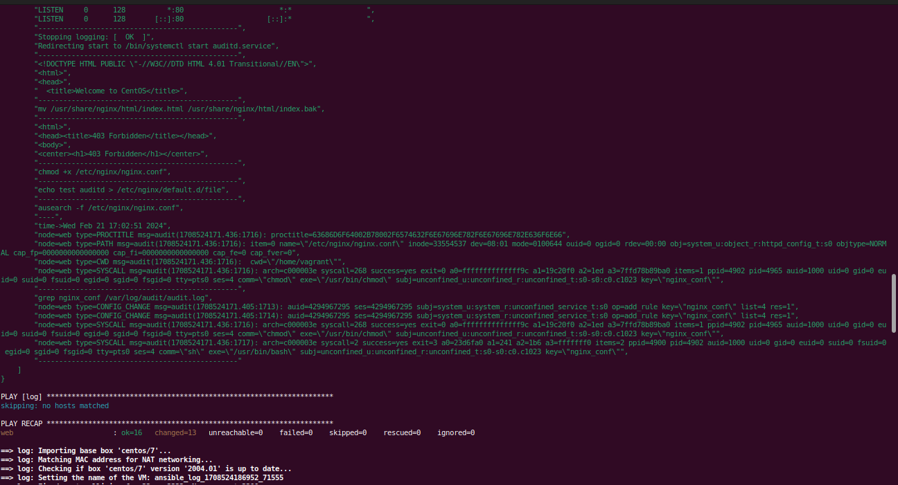

### homework16
# Сбор и анализ логов

Все действия в задании разделены по хостам и прописаны в playbook. Все конфигурационные файлы которые необходимо заменить по ходу действий собраны по хостам в директории ansible/provisioning/files - соответствеено web и log.

Результаты и проверка всех действий собрана в скриптах log_script.sh и web_script.sh и находятся в тех же директориях. После проигрывания playbook, запускается соответствующий скрипт, который отображает корректность всех выполненных в ansible дествий.

 
 
 
 
В клиенте "web", все удалось замечательно. Для отображения логов в сервере "log" нужны события, логи которых будут отправлены с "web" на "log". Поэтому на браузере хоста надо обновить страницу nginx http://192.168.56.10, после этого на "log" появятся события службы rsyslog:
```
[root@log vagrant]# tail /var/log/rsyslog/web/nginx_access.log
Feb 21 17:21:05 web nginx_access: 192.168.56.15 - - [21/Feb/2024:17:21:05 +0300] "GET / HTTP/1.1" 403 153 "-" "curl/7.29.0"
Feb 21 17:22:18 web nginx_access: 192.168.56.1 - - [21/Feb/2024:17:22:18 +0300] "GET / HTTP/1.1" 403 555 "-" "Mozilla/5.0 (X11; Linux x86_64) AppleWebKit/537.36 (KHTML, like Gecko) Chrome/120.0.0.0 Safari/537.36"
Feb 21 17:22:19 web nginx_access: 192.168.56.1 - - [21/Feb/2024:17:22:19 +0300] "GET / HTTP/1.1" 403 555 "-" "Mozilla/5.0 (X11; Linux x86_64) AppleWebKit/537.36 (KHTML, like Gecko) Chrome/120.0.0.0 Safari/537.36"
[root@log vagrant]# tail /var/log/rsyslog/web/nginx_error.log
Feb 21 17:21:05 web nginx_error: 2024/02/21 17:21:05 [error] 5026#5026: *3 directory index of "/usr/share/nginx/html/" is forbidden, client: 192.168.56.15, server: _, request: "GET / HTTP/1.1", host: "192.168.56.10"
Feb 21 17:22:18 web nginx_error: 2024/02/21 17:22:18 [error] 5026#5026: *4 directory index of "/usr/share/nginx/html/" is forbidden, client: 192.168.56.1, server: _, request: "GET / HTTP/1.1", host: "192.168.56.10"
Feb 21 17:22:19 web nginx_error: 2024/02/21 17:22:19 [error] 5026#5026: *4 directory index of "/usr/share/nginx/html/" is forbidden, client: 192.168.56.1, server: _, request: "GET / HTTP/1.1", host: "192.168.56.10"
```
Для получения логов auditd нужно перезапустить службу nginx на "web". Почему так происходит, ответа я не нашел.
Первый ввод команды tail /var/log/audit/audit.log | grep web был осуществлен до перезагрузки systemctl restart nginx, второй после. 
```
[root@log vagrant]# tail /var/log/audit/audit.log | grep web
[root@log vagrant]# tail /var/log/audit/audit.log | grep web
node=web type=USER_ACCT msg=audit(1708525390.192:1835): pid=5212 uid=1000 auid=1000 ses=5 subj=unconfined_u:unconfined_r:unconfined_t:s0-s0:c0.c1023 msg='op=PAM:accounting grantors=pam_unix,pam_localuser acct="vagrant" exe="/usr/bin/sudo" hostname=? addr=? terminal=/dev/pts/0 res=success'
node=web type=USER_CMD msg=audit(1708525390.202:1836): pid=5212 uid=1000 auid=1000 ses=5 subj=unconfined_u:unconfined_r:unconfined_t:s0-s0:c0.c1023 msg='cwd="/home/vagrant" cmd="su" terminal=pts/0 res=success'
node=web type=CRED_REFR msg=audit(1708525390.202:1837): pid=5212 uid=0 auid=1000 ses=5 subj=unconfined_u:unconfined_r:unconfined_t:s0-s0:c0.c1023 msg='op=PAM:setcred grantors=pam_env,pam_unix acct="root" exe="/usr/bin/sudo" hostname=? addr=? terminal=/dev/pts/0 res=success'
node=web type=USER_START msg=audit(1708525390.217:1838): pid=5212 uid=0 auid=1000 ses=5 subj=unconfined_u:unconfined_r:unconfined_t:s0-s0:c0.c1023 msg='op=PAM:session_open grantors=pam_keyinit,pam_keyinit,pam_limits,pam_systemd,pam_unix acct="root" exe="/usr/bin/sudo" hostname=? addr=? terminal=/dev/pts/0 res=success'
node=web type=USER_AUTH msg=audit(1708525390.228:1839): pid=5214 uid=0 auid=1000 ses=5 subj=unconfined_u:unconfined_r:unconfined_t:s0-s0:c0.c1023 msg='op=PAM:authentication grantors=pam_rootok acct="root" exe="/usr/bin/su" hostname=web addr=? terminal=pts/0 res=success'
node=web type=USER_ACCT msg=audit(1708525390.228:1840): pid=5214 uid=0 auid=1000 ses=5 subj=unconfined_u:unconfined_r:unconfined_t:s0-s0:c0.c1023 msg='op=PAM:accounting grantors=pam_succeed_if acct="root" exe="/usr/bin/su" hostname=web addr=? terminal=pts/0 res=success'
node=web type=CRED_ACQ msg=audit(1708525390.228:1841): pid=5214 uid=0 auid=1000 ses=5 subj=unconfined_u:unconfined_r:unconfined_t:s0-s0:c0.c1023 msg='op=PAM:setcred grantors=pam_rootok acct="root" exe="/usr/bin/su" hostname=web addr=? terminal=pts/0 res=success'
node=web type=USER_START msg=audit(1708525390.234:1842): pid=5214 uid=0 auid=1000 ses=5 subj=unconfined_u:unconfined_r:unconfined_t:s0-s0:c0.c1023 msg='op=PAM:session_open grantors=pam_keyinit,pam_limits,pam_systemd,pam_unix,pam_xauth acct="root" exe="/usr/bin/su" hostname=web addr=? terminal=pts/0 res=success'
node=web type=SERVICE_STOP msg=audit(1708525411.560:1843): pid=1 uid=0 auid=4294967295 ses=4294967295 subj=system_u:system_r:init_t:s0 msg='unit=nginx comm="systemd" exe="/usr/lib/systemd/systemd" hostname=? addr=? terminal=? res=success'
node=web type=SERVICE_START msg=audit(1708525411.624:1844): pid=1 uid=0 auid=4294967295 ses=4294967295 subj=system_u:system_r:init_t:s0 msg='unit=nginx comm="systemd" exe="/usr/lib/systemd/systemd" hostname=? addr=? terminal=? res=success'
[root@log vagrant]# 
```

